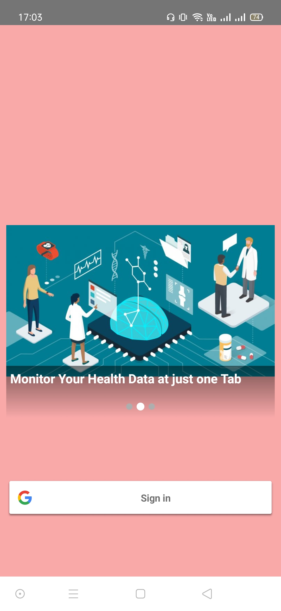
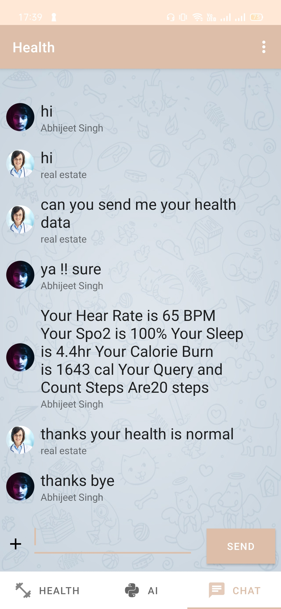
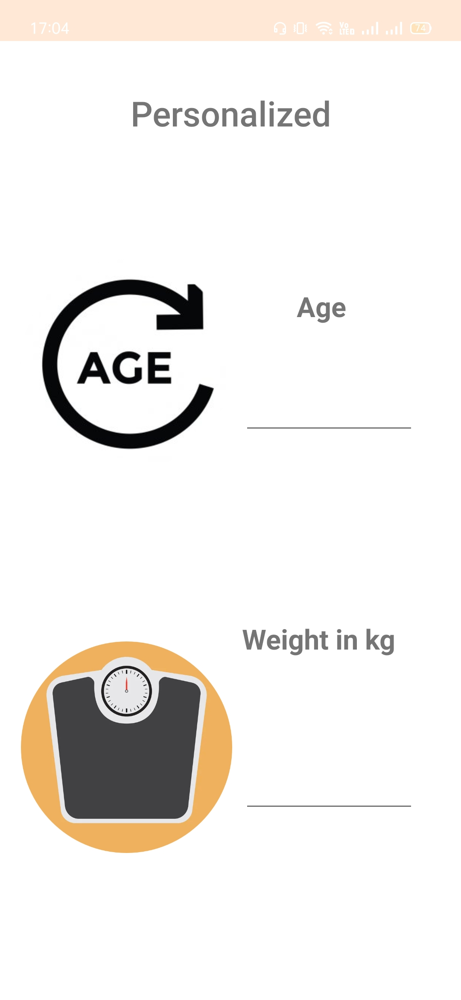
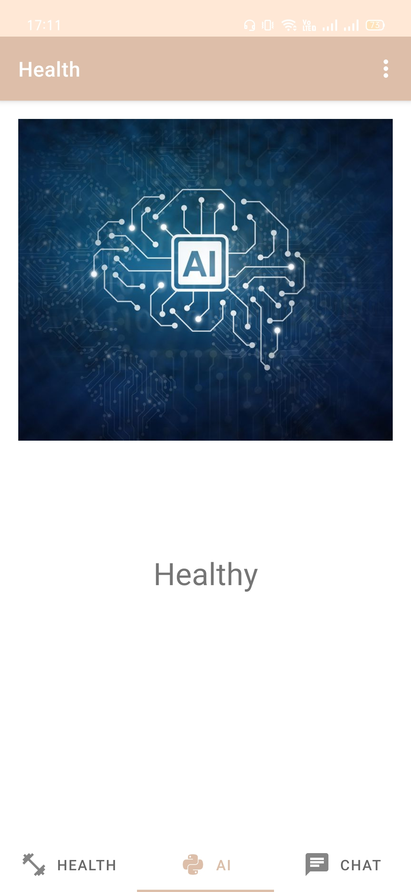
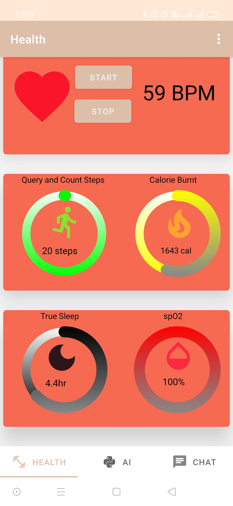
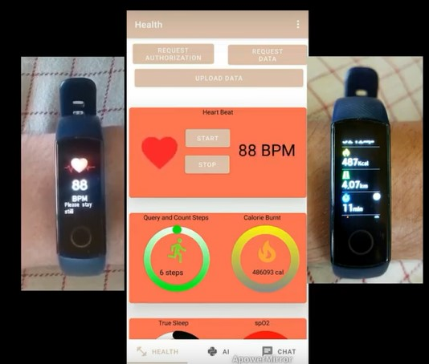

## Hack For Sport

## Next-Generation Fitness Using AI and Wearbale Band

# Problem

Fitness App and Wearables Till Now

1.	Wearable band track only health parameter and do not provide insight 

     -	Wearable Tech track user health data such as calorie burnt, spO2 , sleep ,etc.

     -	It doesn’t provide the insight such as how much calorie should I burn to get fit or how much sleep should I get after the matchday or 
                is there anomaly in user health data

2.	No Platform to Connect with Sport Professional or Trainer

     -	If a user wants to share his health data insight there is no platform to share .

     -	User from outside area find it difficult to get help from better sport professional or Trainer

3.	Inefficient Technology to keep tab on health and Expensive

     -	Keeping tab on Health is expensive 

     -	Overall regime is very expensive

## Solution

NEXGEN4SPORT in action

1.	Health app a fast and efficient android application for Fitness.

2.	AI technology for Insight 

3.	NEXGENAI a LSTM based model trained on open health dataset model to detect anomaly in user health relative to user baseline and tell user which health parameter is needed to improve .

4.	Wearable device is an accurate way to establish individual to baseline parameter of health, which can be used to detect significant deviation from normal health

5.	Convenience of consulting with Sport professional or trainer with inbuild health app chat .

6.	Optimized dashboard for user to keep tab on their health .

7.	Safe and Easy login with Google auth.

8.	Supports most of wearable bands and provide real time monitoring of health data. 

## Welcome to join in and feel free to contribute.